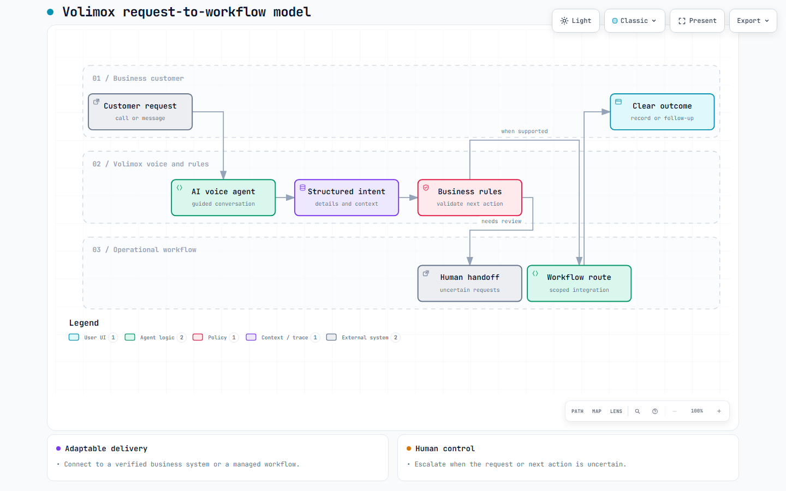

# Volimox

**AI voice agents and workflow automation for businesses.**

Volimox helps businesses turn incoming conversations into structured requests and useful follow-up. The project includes the company's public website and demonstrations, alongside a delivery model for voice intake and operational workflows.

## The service model

The design brings together:

- Guided voice conversations that capture intent and the details needed for action.
- Business rules that check what can happen next.
- A scoped connection to an existing business system or a managed workflow, depending on the customer's setup.
- Human handoff when a request or integration outcome needs review.

Customer-specific integrations are scoped against the systems they actually use; the public demos show the direction without claiming every connection is live.

**Selected stack:** Next.js and TypeScript for the public site and demonstrations.

## Project activity

| Development history | Pull requests | Commits on main |
| --- | ---: | ---: |
| May–September 2026 (~4 months) | 9 | 25 |

*Figures reflect the private development repository as of September 24, 2026. This public repository contains an overview and diagram; the product source remains private.*
